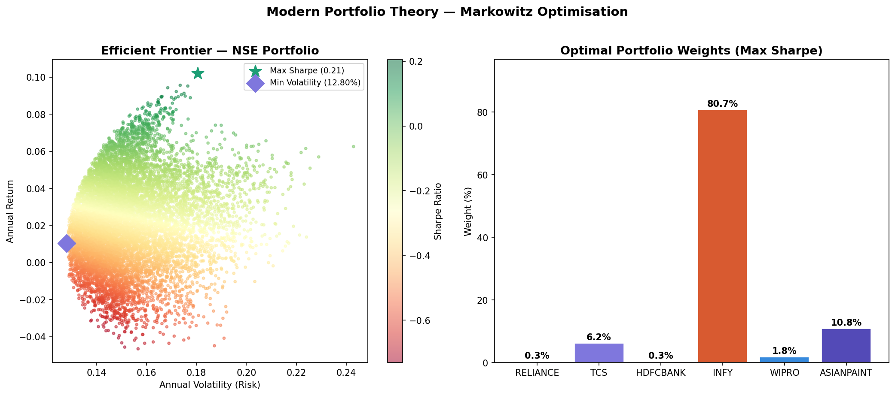

# Portfolio Optimiser — Efficient Frontier

Implements **Modern Portfolio Theory (Markowitz, 1952)** to find the optimal 
allocation across 6 NSE stocks using 10,000 Monte Carlo simulations.

## Output


## What it does
- Downloads 3 years of real NSE stock data using yfinance
- Runs 10,000 random portfolio weight simulations
- Identifies the **maximum Sharpe ratio** portfolio (best risk-adjusted return)
- Identifies the **minimum variance** portfolio (lowest possible risk)
- Plots the full efficient frontier colour-coded by Sharpe ratio

## Theory
Based on Harry Markowitz's Modern Portfolio Theory — the framework behind 
how every fund manager allocates capital. The efficient frontier shows all 
portfolios that maximise return for a given level of risk.

> "Diversification is the only free lunch in finance." — Harry Markowitz

## Stocks analysed
| Stock | Sector |
|---|---|
| Reliance Industries | Energy / Conglomerate |
| TCS | Technology |
| HDFC Bank | Banking |
| Infosys | Technology |
| Wipro | Technology |
| Asian Paints | Consumer |

## Key metrics explained
| Metric | Formula | Meaning |
|---|---|---|
| Sharpe Ratio | (Return − Rf) / Volatility | Return earned per unit of risk |
| Volatility | Annualised std deviation | How much returns fluctuate |
| Efficient Frontier | All optimal portfolios | Best return for each risk level |

Risk free rate used: **6.5%** (Indian 10yr government bond yield)

## How to run
```bash
pip install pandas numpy matplotlib yfinance scipy
python3 portfolio_optimiser.py
```

## What I'd improve next
- Add weight constraints (e.g. max 30% per stock)
- Include transaction costs and rebalancing
- Extend to international diversification
- Add Value at Risk overlay on the frontier

## Related projects
- [Credit Risk Scorecard](https://github.com/techgirlme/credit-risk-scorecard) — logistic regression default prediction model

## Author
**Parvathy Raman**  
B.Sc. Data Science & Applied Statis
tics — Symbiosis Statistical Institute, Pune  
IEEE published researcher in credit risk modelling  
[LinkedIn](linkedin.com/in/parvathy-raman-82a7ba354)
